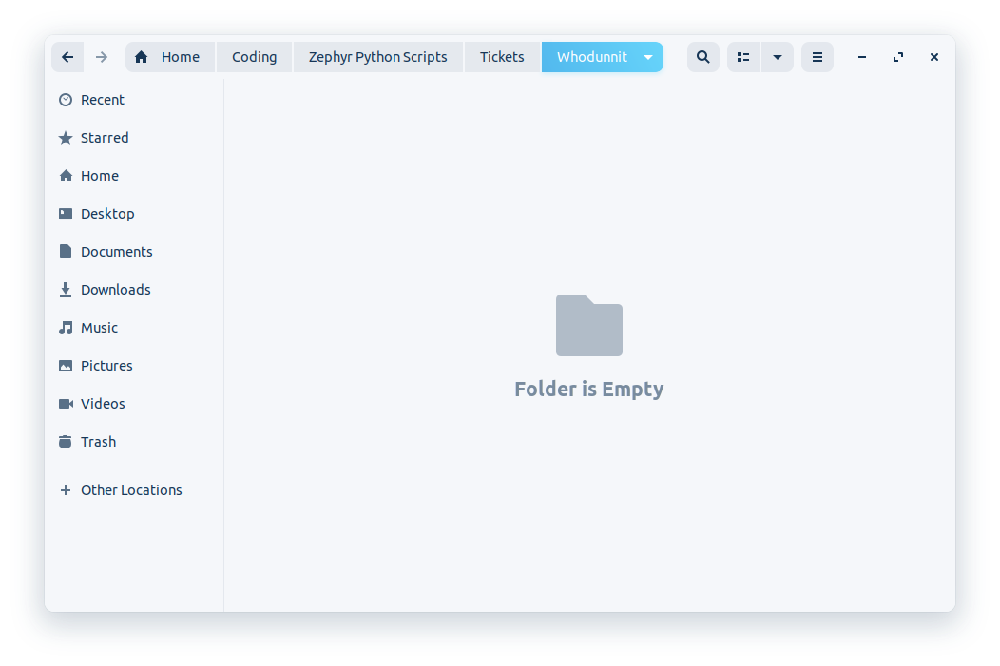
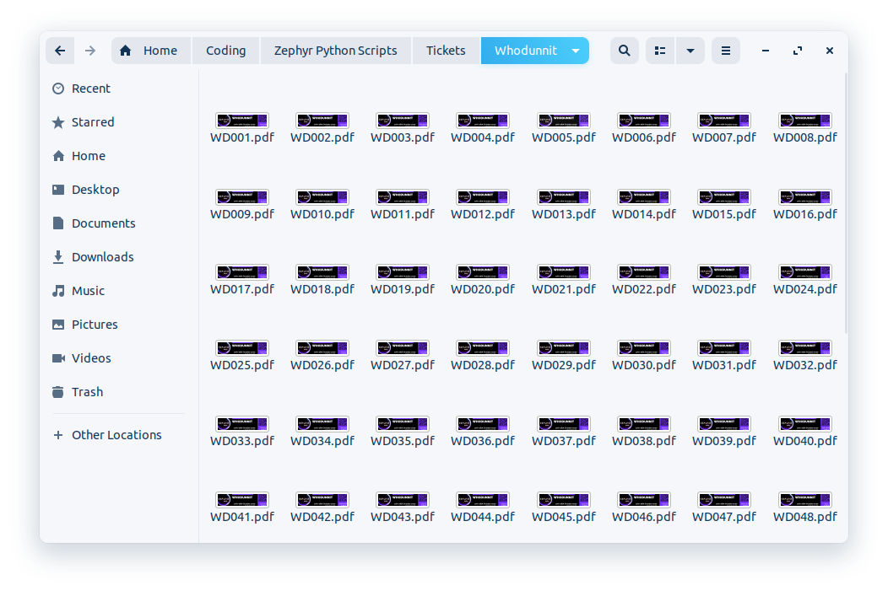
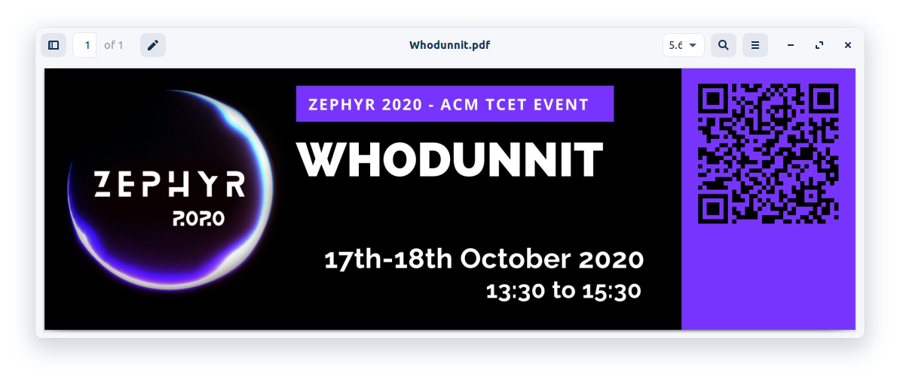
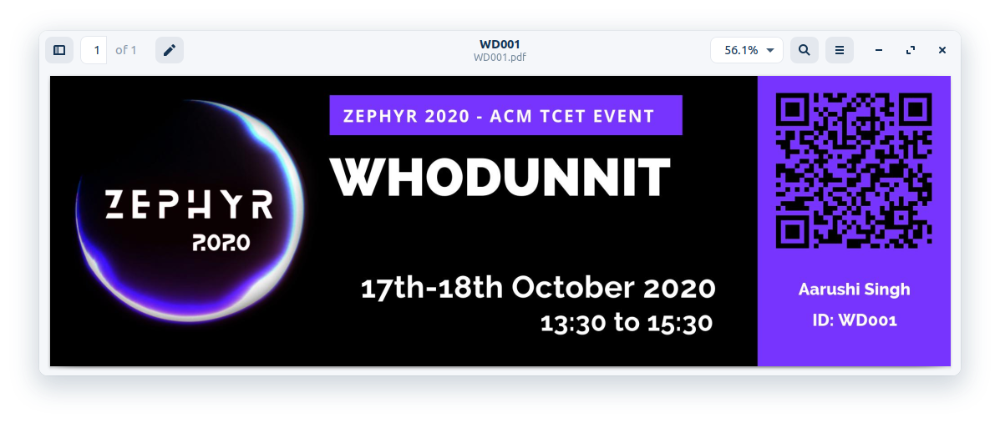

# Invite/Certificate Generator & Sender (Python Bot)

## Introduction
A Python bot/script which generates personalized invites and certificates from csv and then sends them to the participant via Email & WhatsApp

## Images

### Folder (Before & After)

    
    

### Invites (Before & After)

    
    

- Email (Sent folder)
  // TODO

- WhatsApp (Sent Chat)
  No SS Available

## Background
- During our annual college technical fest (Zephyr 2020), we at TCET ACM had over 1000 participants.
- Since most of our events were free, participants had to be reminded too, and hence invites were needed.
We had to send them invites and then later certificates virtually.
- Invites could be non-personalized i.e generic and sent via a single email (adding everyone in BCC)
- But for certificates, we had to make them personalized and send to everyone separately.

## BrainStorming
- There are tools like Google AutoCrat but it's free version is limited to 100 emails per day and it would take over a week for all our participants.
- So instead, I just decided to write a python script to generate personalized certificates and send them over email to every participant.

## Solution
- Since this was being done for certificates, I thought to myself, why not send personalized invites too (with participant name on each invite).
- With my experience during a previous online fest (Evolution 2020), we had learnt that many participants do not check their emails for invites.
- Hence, I thought to take it to the next level by sending them personally over WhatsApp along with email.

## Impact
- The use case was way better than we expected. The response for the free events because of invites' reminder exceeded our expectations and was wonderful. 

## Note
- Since I realize the power of this bot to send personalized Emails and WhatsApp message to (in theory) every person in this world, it can cause a spam and misuse. 
- Hence I am not sharing the code for sending via Email and WhatsApp

## License

    Apache License, Version 2.0

    Licensed under the Apache License, Version 2.0 (the "License");
    you may not use this file except in compliance with the License.
    You may obtain a copy of the License at

        http://www.apache.org/licenses/LICENSE-2.0

    Unless required by applicable law or agreed to in writing, software
    distributed under the License is distributed on an "AS IS" BASIS,
    WITHOUT WARRANTIES OR CONDITIONS OF ANY KIND, either express or implied.
    See the License for the specific language governing permissions and
    limitations under the License.
